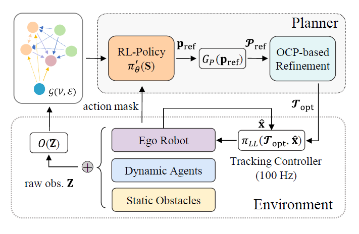
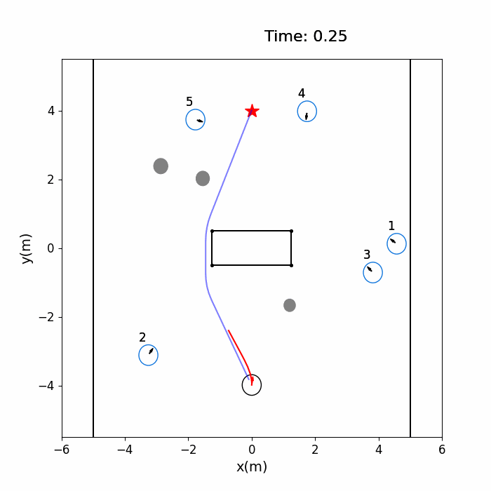
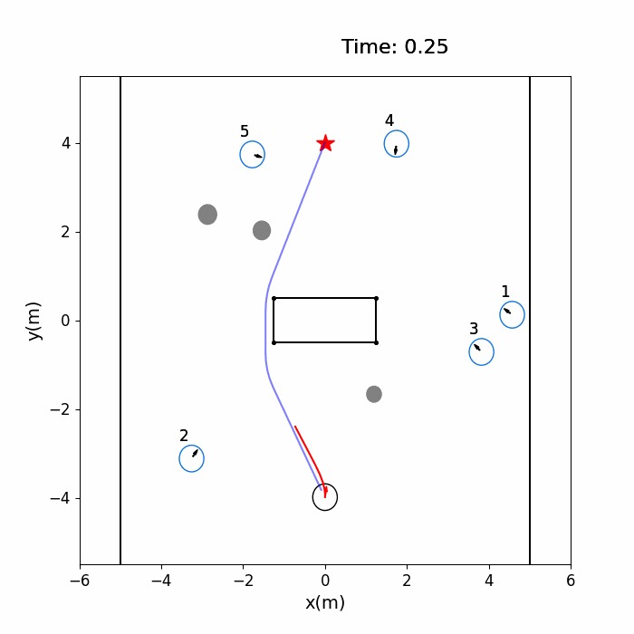
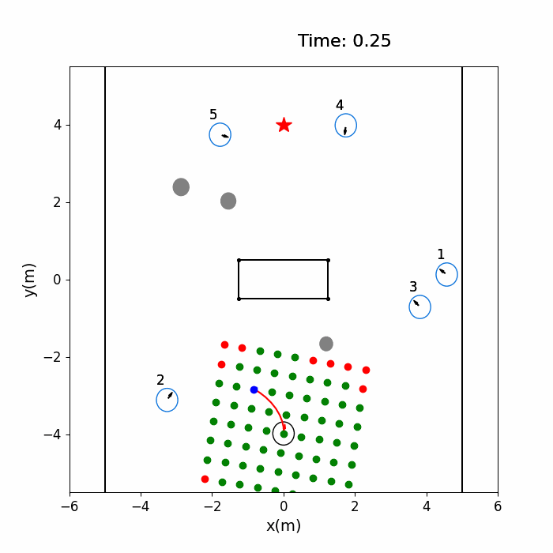
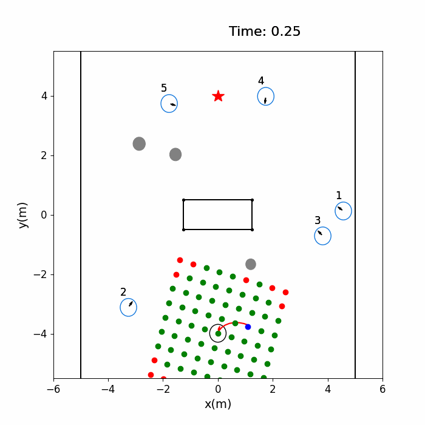

# Hierarchical Learning-Enhanced MPC for Safe Crowd Navigation with Heterogeneous Constraints

<a href="https://arxiv.org/abs/2506.09859"></a> <a href="https://www.bilibili.com/video/BV166MizgEht/?vd_source=a658930295bb4510212c5c979d654d61"></a>

## TODO list

- [x] Release the [arXiv paper](https://arxiv.org/abs/2506.09859) in June, 2025.
- [ ] Release the training and evaluation code
- [ ] Release the ros wrapper.

## Abstract

In this paper, we propose a novel **hierarchical framework** for robot navigation in dynamic environments with heterogeneous constraints. Our approach leverages a graph neural network trained via reinforcement learning (RL) to efficiently estimate the robot’s **cost-to-go**, formulated as local goal recommendations. A **spatio-temporal path-searching** module, which accounts for kinematic constraints, is then employed to generate a reference trajectory to facilitate solving the non-convex optimization problem used for explicit constraint enforcement. More importantly, we introduce an **incremental action-masking** mechanism and a **privileged learning** strategy, enabling end-to-end training of the proposed planner. Both simulation and real-world experiments demonstrate that the proposed method effectively addresses local planning in complex dynamic environments, achieving state-of-the-art (SOTA) performance. Compared with existing learning-optimization hybrid methods, our approach eliminates the dependency on high-fidelity simulation environments, offering significant advantages in computational efficiency and training scalability.



## Contributions

This paper proposes **three key techniques** that effectively address the performance limitations of traditional Model Predictive Control (MPC) in dynamic environments.

|            Astar + MPC            |         Spatio-temporal search + MPC          |
| :-------------------------------: | :-------------------------------------------: |
|  |                 |
|                                   |            Better initial solution            |
|       **Action Mask + MPC**       |  **Action Mask + Privileged learning + MPC**  |
|    |             |
|          Better decision          | Better performance and inter-frame continuity |

Real world demonstrations are available on the [video](https://www.bilibili.com/video/BV166MizgEht/?vd_source=a658930295bb4510212c5c979d654d61).

## Citation

If you find this code or paper is helpful, please kindly star :star: this repository and cite our paper by the following BibTeX entry:

```bibtex
@misc{liu2025hierarchicallearningenhancedmpcsafe,
      title={Hierarchical Learning-Enhanced MPC for Safe Crowd Navigation with Heterogeneous Constraints}, 
      author={Huajian Liu and Yixuan Feng and Wei Dong and Kunpeng Fan and Chao Wang and Yongzhuo Gao},
      year={2025},
      eprint={2506.09859},
      archivePrefix={arXiv},
      primaryClass={cs.RO},
      url={https://arxiv.org/abs/2506.09859}, 
}
```


